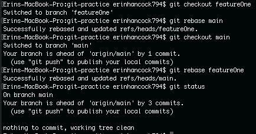
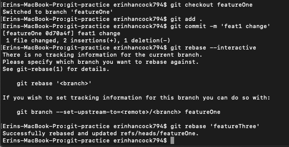
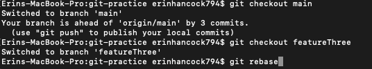
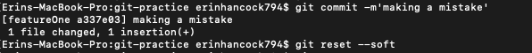
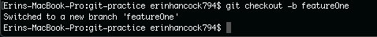
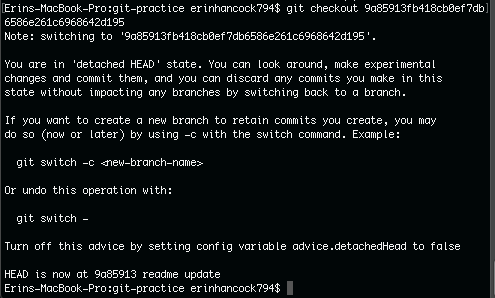
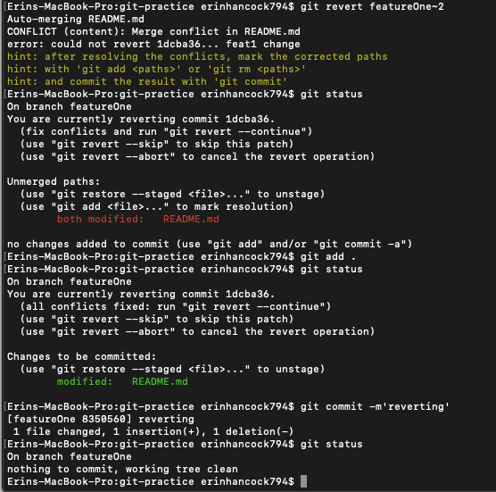

### Git Rebase

Git rebase is when you combine commit histories from various branches together. This mainly helps with keeping commit histories organized. The advantages of using git rebase is when there are multiple branches with their own commit histories, you can rebase everything together so it has a record of everything. You can also go back to the main branch and do a fast-forward merge which brings the main branch up to the current changes. The disadvantages of rebasing is that it's easy to mess up, and you can lose commit history if you do it incorrectly. It doesn't work well for open-source projects either.

You shouldn't rebase commits outside the remote repo that other people's are using for their work.

 *A Rebase Merge*
 

----
*An Interactive Rebase Merge*

----
*When to NOT Rebase*

You should always pull before rebasing. 

----

#### Git Reset

Git reset will take you back to the commit that you specify, but it can orphan commits if you aren't careful. Git reset --hard will reset the working directory, staged snapshot, and commit history. --mixed will reset the staging area and commit history, and --soft will resets commit history. You could use this if you committed something you didn't mean to commit for whatever reason. You can reset the commit and make corrections to the working tree files.

*Git Reset*

----

#### Git Checkout

Git checkout is used to switch to another branch or commit. It moves the head pointer to wherever you specify. Checking out a commit sends you to a detached head state because the head pointer isn't attached to a branch. You do NOT want to commit when you're in this state. You'd use git checkout anytime you want to work in another branch or commit. 

*Git Checkout to a branch*

----

*Git Checkout to a commit*

----

#### Git Revert

Git revert moves you forward while grabbing a previous commit. The other commits in between still exist, and the history isn't changed. You'd want to do this if an old commit introduced a bug, and you want to fix it. 

Git reset, checkout, and revert are similar because you're working with branches and branch history. You can go back through commit histories with all of them. 

*Git Revert*

----

#### Git Submodules

Git submodules are essentially a repo inside of a repo. They have their own commit histories. It's great for when you're working on a big project and one section of the project requires the libraries/code used in the big project. Submodules let you use a small repo as a subdirectory of the other. You can clone another repo into your own repository and keep your commits separate. One of the disadvantages of these though, are when you merge submodule changes. If you merge at the same time as someone else, you'll have conflicts because the submodules histories have diverged and have been committed to diverging branches so it could be hard to merge all the conflicts. It's also difficult to switch branches because if you create a new branch and add a submodule, and then switch back to a different branch, you will still have the submodule directory as untracked. If you remove it, and then switch back to the branch with the submodule, you have to remember to update it (submodule update --init).
